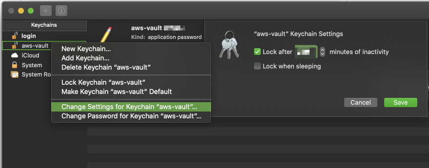

You can choose among different pluggable secret storage backends. You can set the backend using the `--backend` flag or the `AWS_VAULT_BACKEND` environment variable. Run `aws-vault --help` to see what your `--backend` flag supports.

The supported vaulting backends are:

| Internal name | Backend | How it works | Platforms |
| --- | --- | --- | --- |
| `keychain` | [macOS Keychain](https://support.apple.com/en-au/guide/keychain-access/welcome/mac) | Stores credentials as generic password items in the configured Keychain. Optional biometrics support can use Touch ID to unlock the aws-vault keychain. | macOS |
| `wincred` | [Windows Credential Manager](https://support.microsoft.com/en-au/help/4026814/windows-accessing-credential-manager) | Stores credentials as generic credentials under an aws-vault target-name prefix in Windows Credential Manager. | Windows |
| `winhello` | [Windows Hello](https://support.microsoft.com/en-us/windows/configure-windows-hello-dae28983-8242-bb2a-d3d1-87c9d265a5f0) | Stores encrypted envelopes in Windows Credential Manager. The encryption key is wrapped by Windows Hello / Passport, so reads require PIN/biometrics. | Windows |
| `secret-service` | Secret Service ([GNOME Keyring](https://wiki.gnome.org/Projects/GnomeKeyring), [KWallet](https://apps.kde.org/kwalletmanager5/), ...) | Stores credentials in a Secret Service collection over the desktop session D-Bus. The collection may be unlocked by the desktop keyring service. | Linux |
| `kwallet` | [KWallet](https://apps.kde.org/kwalletmanager5/) | Stores credentials as entries in the configured KWallet folder over the KDE Wallet D-Bus service directly (rather than through the Secret Service API). | Linux |
| `keyctl` | [Linux kernel keyring](https://man7.org/linux/man-pages/man7/keyrings.7.html) | Stores credentials in the Linux kernel key retention service, optionally inside a named keyring for the configured service. | Linux |
| `pass` | [Pass](https://www.passwordstore.org/) | Stores JSON-encoded credential items in a `pass` password store, encrypted by GPG and managed through the `pass` command. | macOS, Linux, FreeBSD |
| `passage` | [Passage](https://github.com/FiloSottile/passage) | Stores JSON-encoded credential items in a Passage store, encrypted with age and managed through the `passage` command. | macOS, Linux, FreeBSD |
| `file` | Encrypted file | Stores one encrypted file per credential under `AWS_VAULT_FILE_DIR` (by default `~/.awsvault/keys/`) using passphrase-based JWE encryption. | All platforms |
| `op-connect` | [1Password Connect](https://developer.1password.com/docs/connect/) | Stores credentials as concealed fields in 1Password items through a 1Password Connect server and token. | Windows, macOS, Linux |
| `op` | [1Password Service Accounts](https://developer.1password.com/docs/service-accounts) | Stores credentials as concealed fields in 1Password items through the 1Password SDK using a service account token. | Windows, macOS, Linux |
| `op-desktop` | [1Password Desktop App](https://developer.1password.com/docs/sdks/desktop-app-integrations/) | Stores credentials as concealed fields in 1Password items through the local 1Password desktop app integration. | Windows, macOS, Linux |
| `proton-pass`* | [Proton Pass](https://proton.me/pass) | Stores credentials as items in a Proton Pass vault, accessed directly via Proton's HTTPS API using a scoped Personal Access Token. See [USAGE.md#proton-pass](#proton-pass) for setup. **Experimental**| Windows, macOS, Linux |

Use the `--backend` flag or `AWS_VAULT_BACKEND` environment variable to specify a backend. Run `aws-vault --help` to see the backends available in your build and environment.

By default, `aws-vault` selects the first available backend for the platform: `wincred` on Windows, `keychain` on macOS, and `secret-service` on Linux when Secret Service is available. On Linux, automatic selection then falls back through `kwallet`, `keyctl`, `pass`, `passage`, and `file`. The 1Password and Proton Pass backends are opt-in and are listed after `file`, so choose them explicitly with `--backend` or `AWS_VAULT_BACKEND`.

## Keychain

If you're looking to configure the amount of time between having to enter your Keychain password for each usage of a particular profile, you can do so through Keychain:

1. Open "Keychain Access"
2. Open the aws-vault keychain. If you do not have "aws-vault" in the sidebar of the Keychain app, then you can do "File -> Add Keychain" and select the `aws-vault.keychain-db`. This is typically created in `Users/{USER}/Library/Keychains`.
3. Right click on aws-vault keychain, and select "Change Settings for Keychain 'aws-vault"
4. Update "Lock after X minutes of inactivity" to your desired value.
5. Hit save.




## Proton Pass

> ⚠️ Experimental. The `proton-pass` backend talks to an undocumented, internal Proton API and depends on a credential model that may change. Review the Terms of Service note below before using it for anything unattended.

The `proton-pass` backend stores each profile's credentials as an item in a [Proton Pass](https://proton.me/pass) vault, reached directly over Proton's HTTPS API. It does not shell out to the Proton Pass CLI at runtime — you only use the CLI once, to mint and scope the access token.

aws-vault authenticates with a Proton Pass **Personal Access Token (PAT)**, a scoped, Proton-issued automation credential of the form `pst_<token>::<key>`. The whole string is the credential: the `pst_<token>` half is exchanged for a session, and the `::<key>` half is the key that decrypts the vault.

### 1. Mint and scope a PAT

Install the [Proton Pass CLI](https://github.com/protonpass/pass-cli) and log in, then create a token and grant it access. A dedicated vault keeps aws-vault's items isolated:

```shell
# Optional: a dedicated vault for aws-vault items
pass-cli vault create --name aws-vault

# Mint the PAT — the pst_…::… value is printed ONCE; store it now
# --expiration is one of: 1d, 1w, 1m, 3m, 6m, 1y
pass-cli pat create --name aws-vault --expiration 3m

# Find the token's <ID>
pass-cli pat list

# Grant access (see the grant-scope table below for which role/scope you need)
pass-cli pat access grant --pat-id <ID> --vault-name aws-vault --role editor

# ...or, for least privilege, scope to one already-existing profile item.
# The item title is "<prefix>/<profile>" (default prefix "aws-vault"):
pass-cli pat access grant --pat-id <ID> --vault-name aws-vault \
  --item-title aws-vault/my-profile --role viewer
```

The grant determines what aws-vault can do, and Proton's role model (`viewer` < `editor` < `manager`) governs the rest:

| Command | Operation | Grant that works |
| --- | --- | --- |
| `aws-vault add` | create item | **vault-level `editor`** — the PAT must be a member of the vault; a per-item grant cannot create new items |
| `aws-vault exec`, `list` | read | per-item grant (read-only `viewer` is enough) |
| `aws-vault remove` | delete | per-item grant with a writable role (`editor`) |

The `add`-needs-a-vault-level-grant constraint is the one that bites in practice; the read/update/delete rows follow Proton's role model. The simplest setup is a single vault-level `editor` grant, which covers every command. Use a per-item token only when the profile already exists and you want least privilege (for example a read-only `viewer` token on a CI runner that only runs `exec`).

### 2. Find the Share ID

A grant creates a recipient share for the PAT with its own Share ID. That ID — not the vault owner's — is what aws-vault needs:

```shell
pass-cli pat access list-access --pat-id <ID>
```

### 3. Configure aws-vault

```shell
export PROTON_PASS_PERSONAL_ACCESS_TOKEN='pst_xxxx::KEY'

aws-vault --backend=proton-pass \
  --proton-pass-share-id=<SHARE_ID> \
  add my-profile
```

Set `AWS_VAULT_BACKEND=proton-pass` and `AWS_VAULT_PROTON_PASS_SHARE_ID=<SHARE_ID>` to avoid repeating the flags. If `PROTON_PASS_PERSONAL_ACCESS_TOKEN` is unset, aws-vault prompts for the token. The token is never accepted as a command-line flag, which would leak it into the process list and shell history.

The backend also reads the Proton Pass CLI's own `PROTON_PASS_SHARE_ID` and `PROTON_PASS_API_BASE` variables as a fallback, so an existing CLI environment works unchanged. The aws-vault-specific `AWS_VAULT_PROTON_PASS_*` variables (and their flags) take precedence when both are set.

### Session caching and rate limits

The first command exchanges your PAT for a Proton session and caches that session in your **OS keychain** (macOS Keychain, Secret Service, KWallet, or Windows Credential Manager), under a dedicated `aws-vault-proton-pass-session` entry. Subsequent commands reuse it, so a normal `add` → `list` → `exec` sequence performs a single login. The cache entry is keyed to your token, so rotating the PAT invalidates it automatically; a session that Proton has expired or revoked is detected and the PAT re-exchanged on the next call.

This caching is what keeps the backend under Proton's login rate limit. Without it, every command re-runs the full exchange, and a few commands in quick succession trip `HTTP 429 / code 2028 "Too many recent logins"`. On a host with **no OS keychain available** (for example a headless Linux box with no Secret Service), the session cannot be cached and every operation re-exchanges the PAT — space your commands out, or expect the occasional rate-limit error.

`--proton-pass-timeout` (default `30s`, env `AWS_VAULT_PROTON_PASS_TIMEOUT`) bounds each operation, including the several HTTP calls a single command makes.

Errors are reported plainly: a rate-limit response tells you to wait and retry; a rejected PAT tells you to mint or re-grant a token; and a demand for human verification (CAPTCHA / 2FA), which this client cannot satisfy, asks you to re-authenticate with the Proton Pass app or CLI to clear it.

### Terms of Service

Proton's [Terms of Service](https://proton.me/legal/terms) (Section 2, "Authorized use of the Services") prohibit accessing the Services "through automated means (including but not limited to bots, scripts, or similar technologies)". Interactive use — running `aws-vault exec` yourself, with you present — reads as an unofficial client acting on your behalf. **Unattended or CI use is the gray area for that clause and is at your own risk.** A PAT is the most clearly authorized automation credential Proton offers, but it does not exempt you from the automated-access clause. This is an engineering reading, not legal advice; get sign-off before relying on it for unattended access.
