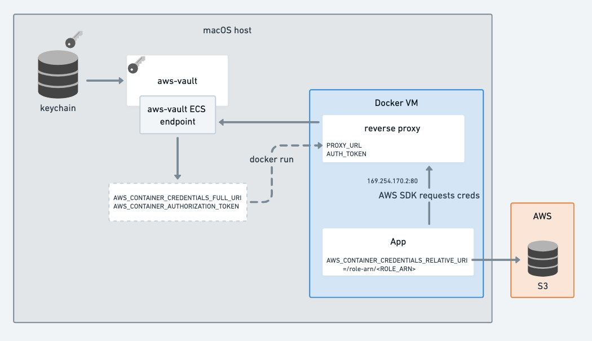

It's possible for Docker containers to retrieve credentials from aws-vault running on the host.



The ECS server responds to requests on `/role-arn/YOUR_ROLE_ARN` with the role credentials, making it usable with the
`AWS_CONTAINER_CREDENTIALS_FULL_URI` or `AWS_CONTAINER_CREDENTIALS_RELATIVE_URI` environment
variables. These environment variables are used by the AWS SDKs as part of the
[default credential provider chain](https://docs.aws.amazon.com/sdk-for-java/v1/developer-guide/credentials.html#credentials-default).

In particular, this is designed to allow aws-vault to run on your local host while docker images access role credentials
dynamically. This is achieved via a reverse-proxy container (started with `aws-vault exec --ecs-server --lazy PROFILE --
docker-compose up ...`) using the default ECS IP address `169.254.170.2`. Docker containers no longer need AWS keys at
all - instead they can specify the role they want to assume with `AWS_CONTAINER_CREDENTIALS_RELATIVE_URI`.

This use-case is similar to the goal of
[amazon-ecs-local-container-endpoints](https://github.com/awslabs/amazon-ecs-local-container-endpoints/blob/mainline/docs/features.md#vend-credentials-to-containers),
however the difference here is that the long-lived AWS credentials are getting sourced from your keychain via aws-vault.

To test it out:

1. Add a base role to your `~/.aws/config` (replacing with valid values)

   ```ini
   [profile base-role]
   source_profile=myprofile
   role_arn=arn:aws:iam::222222222222:role/aws-vault-test
   mfa_serial=arn:aws:iam::222222222222:mfa/<your.aws.username>
   ```

2. Start a reverse proxy:

   ```shell
   cd contrib/_aws-vault-proxy
   aws-vault --debug exec --server --lazy base-role -- docker compose up --build aws-vault-proxy
   ```

3. In a new terminal, assume a new role

   ```shell
   $ export AWS_CONTAINER_CREDENTIALS_RELATIVE_URI=/role-arn/arn:aws:iam::222222222222:role/another-role-that-can-be-assumed-by-base-role
   $ docker-compose run testapp
   testapp $ aws sts get-caller-identity
   ```
