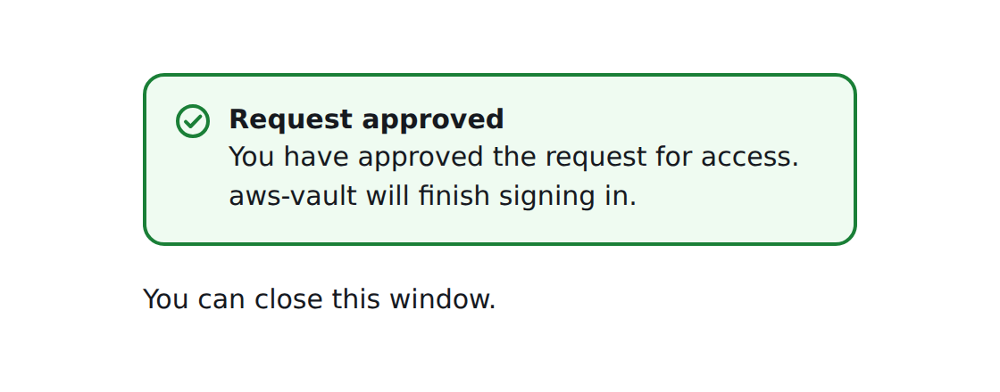

_AWS IAM Identity Center provides single sign on, and was previously known as AWS SSO._

If your organization uses [AWS IAM Identity Center](https://aws.amazon.com/iam/identity-center/) for single sign on, AWS
Vault provides a method for using the credential information defined by
[`aws sso`](https://docs.aws.amazon.com/cli/latest/userguide/cli-configure-sso.html) from v2 of the AWS CLI.
The configuration options are as follows:

* `sso_session` Name of the `[sso-session]` section in the same file with the common options, or:
* `sso_start_url` The URL that points to the organization's AWS IAM Identity Center user portal.
* `sso_region` The AWS Region that contains the AWS IAM Identity Center user portal host. This is separate from, and can
  be a different region than the default CLI region parameter.
* `sso_account_id` The AWS account ID that contains the IAM role that you want to use with this profile.
* `sso_role_name` The name of the Identity Center Permission Group that defines the user's permissions when using this
  profile.
* `sso_registration_scopes` Comma-separated OAuth scopes requested when registering the OIDC client, for example
  `sso:account:access`. With scopes, IAM Identity Center issues a refresh token alongside the access token and
  AWS Vault renews the token in the background shortly before it expires instead of opening a browser. You then only sign in
  again when the Identity Center session itself ends (the session duration is configured by your administrator).
  The default [PKCE sign-in](#signing-in) requests `sso:account:access` when this option is unset, like the AWS CLI, so
  its tokens are always refreshable. The device code flow requests scopes only when this option is set; without them
  the token cannot be refreshed and expires after the fixed lifetime Identity Center assigns it, typically 8 hours.
  This matches the AWS CLI option of the same name and is usually set in the `[sso-session]` section.

Here is an example configuration using AWS IAM Identity Center for single sign on:

```ini
[profile Administrator-123456789012]
sso_start_url=https://aws-sso-portal.awsapps.com/start
sso_region=eu-west-1
sso_account_id=123456789012
sso_role_name=Administrator
```

The same configuration using an `[sso-session]` section with a refreshable token:

```ini
[sso-session my-sso]
sso_start_url=https://aws-sso-portal.awsapps.com/start
sso_region=eu-west-1
sso_registration_scopes=sso:account:access

[profile Administrator-123456789012]
sso_session=my-sso
sso_account_id=123456789012
sso_role_name=Administrator
```

`exec` and `export` expose `sso_account_id` to the sub-process as the `AWS_ACCOUNT_ID` environment variable, so
scripts can use the account ID without calling `aws sts get-caller-identity`.

## Signing in

By default `aws-vault` signs in with the OAuth2 authorization code flow with
[PKCE](https://datatracker.ietf.org/doc/html/rfc7636), like `aws sso login` in v2 of the AWS CLI. `aws-vault` starts a
short-lived callback server on `127.0.0.1` and opens the IAM Identity Center sign-in page in your default browser. Once
you allow access, the browser is sent back to that local server and `aws-vault` exchanges the authorization code for a
token, so there is no code to compare between the terminal and the browser. The browser only ever delivers the code to
your own machine, and the code is useless without the PKCE secret, which never passes through the browser: `aws-vault`
sends it only to AWS. If sign-in isn't completed within 10 minutes, `aws-vault` stops waiting and exits with an error.

`aws-vault` uses the device code flow instead, which shows a URL and code to confirm in any browser, when:

* `--device-code` is passed, or `AWS_VAULT_DEVICE_CODE` is set
* `--stdout` is passed to `exec` or `export`, or `AWS_VAULT_STDOUT` is set for them, since the URL may then be
  opened on another machine. `login --stdout` only prints the console login URL, so SSO sign-in still opens the
  browser; pass `--device-code` to sign in from another machine.
* it runs in an SSH session (`SSH_CONNECTION`, `SSH_CLIENT` or `SSH_TTY` is set)

The browser can only reach the callback server when it runs on the same machine, which is why these cases use the
device code flow. `--device-code` is available on `exec`, `export` and `login`.

To open the sign-in page in a browser other than your default one, pass `--browser` or set `AWS_VAULT_BROWSER`
(available on `exec`, `export` and `login`). The value is an executable on Linux and an application name on macOS:

```shell
AWS_VAULT_BROWSER=google-chrome aws-vault exec work
aws-vault exec --browser "Google Chrome" work # macOS
```

On Linux, `aws-vault` runs the named browser directly rather than through its desktop entry, so a Flatpak browser
needs its exported launcher (e.g. `/var/lib/flatpak/exports/bin/org.mozilla.firefox`). A browser that isn't already
running starts from the terminal running `aws-vault`, so Ctrl-C closes it too.

`login --stdout --browser <browser>` signs in to SSO in that browser and prints the console login URL.

Browsers only let a page close its own tab in limited cases, so the tab usually stays open after signing in, showing
that you can close it:



## Assuming a role with SSO

If your SSO Permission Set allows you to assume another IAM role
(other than the IAM role auto-generated by your permission set),
you can do that by using the `source_profile` option. Here's an example:

```ini
[profile Administrator-123456789012]
sso_start_url=https://aws-sso-portal.awsapps.com/start
sso_region=eu-west-1
sso_account_id=123456789012
sso_role_name=Administrator

[profile AnotherRole-123456789013]
role_arn=arn:aws:iam::123456789013:role/AnotherRole
source_profile=Administrator-123456789012]
```
